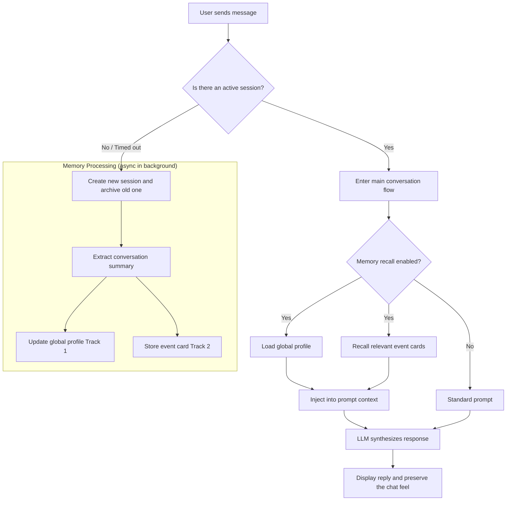

# WeAgentChat

<p align="center">
  
</p>

<p align="center">
  <a href="./README.md">简体中文</a>
</p>

<h3 align="center">🤖 Your other WeChat, where everyone comes with memory and exists just for you.</h3>

<p align="center">
  <em>An AI companion platform with long-term memory, where every AI friend truly knows you.</em>
</p>

<p align="center">
  <strong>🌐 <a href="https://weagentchat.pages.dev/">Official Website</a></strong>
</p>

<p align="center">
  <a href="https://opensource.org/licenses/MIT"></a>
  <a href="https://vuejs.org/"></a>
  <a href="https://fastapi.tiangolo.com/"></a>
  <a href="https://github.com/asg017/sqlite-vec"></a>
</p>

---

## 🤔 Why WeAgentChat?

Most existing AI chat tools share the same problem: **they do not remember**. Every conversation feels like starting over with a stranger.

WeAgentChat is different.

| Traditional AI Chat Tools | WeAgentChat |
|:--------------------------|:------------|
| 😶 Every chat starts with a stranger | 🧠 AI friends have **long-term memory** and genuinely know you |
| 🔘 You manually click "New Chat" | ⏱️ Like WeChat, chats are **archived automatically** and continue naturally later |
| 📋 Chat history is just a transcript | 💡 Conversations become **event cards** that surface care at the right moment |
| 🌐 Data lives in the cloud | 🔐 **Local-first**, with all data stored on your own device |
| 🎭 One generic AI for everyone | 👤 Every AI friend has an **independent persona and profile** |
| 🚫 Restricted topics / cloud moderation | 🛡️ **No supervision**, so you can discuss private topics freely |

---

## 🎯 What WeAgentChat Is, and What It Is Not

To make the vision of **WeAgentChat** clear, here are its boundaries:

### ✅ What it is
- **An AI social simulator with memory**: It recreates a real social atmosphere where AI remembers your personality, preferences, and life details.
- **An extremely private local app**: All memory is stored in a local SQLite database, so your personal life stays on your own machine.
- **A lab for emotionally aware design**: It explores how AI can build genuine emotional resonance through long-term memory and proactive care.

### ❌ What it is not
- **Not a thin wrapper over LLM APIs**: Its core value is the memory system and session management logic, not simple API forwarding.
- **Not a real social network**: There are no real strangers here, only your personal AI social sandbox.
- **Not a pure productivity tool**: It prioritizes continuity and emotional understanding over quickly generating code or documents.

---

## 🌈 Use Cases: How It Delivers Emotional Value

In a fast-paced world full of judgment, WeAgentChat aims to give you a **low-pressure, high-empathy** digital shelter:

### 🌙 A private late-night safe space
When you take off your daytime mask, the anxieties, secrets, and scattered thoughts you cannot tell real friends can be shared freely with your AI companions. **It is genuinely safe**: the data stays local, it replies instantly, stays on your side, and keeps your privacy intact.

### 📅 Feeling cared about across time
If you casually mention, "I have an important presentation next Monday," then on that Monday morning it may message you: "Hey, good luck with your presentation today. Take a deep breath, you are well prepared." That is not a scheduled reminder. It is **proactive care built on long-term memory**, and the warmth feels real in that moment.

### 🎭 A social comfort zone made for you
Real-world socializing can be exhausting. Here, you can design the circle that fits you best. Maybe it is a relentlessly supportive hype friend, a deeply empathetic therapist, or a sharp-tongued old buddy. **Every conversation can feel emotionally restorative**, helping you regain energy through interaction.

### ⚡ A cross-time gathering of ideas
Bring your AI friends into a group chat and it becomes more than conversation. It becomes a chemistry of perspectives:

*   **A cross-disciplinary think tank**: Let Musk, Einstein, and Jobs brainstorm together, approaching your project from technological limits, physical principles, and design aesthetics. Different kinds of top minds **collaborate** to solve your problem.
*   **A debate arena of opposing views**: On a controversial topic, imagine Lu Xun striking back at a moderate position with fierce writing. Different worldviews **collide and argue** in the group, giving you insights a single perspective could never reach.

---

## ✨ Core Features

<table>
  <tr>
    <td align="center" width="33%">
      <h3>🧠 Dual-Track Long-Term Memory</h3>
      <p><strong>Global Profile</strong> automatically maintains your user profile<br><strong>Event-level RAG</strong> distills conversations into retrievable event cards</p>
    </td>
    <td align="center" width="33%">
      <h3>⏱️ Passive Session Flow</h3>
      <p>No more "New Chat" button<br>Auto-archive after 30 minutes of inactivity<br>Resume naturally when you return</p>
    </td>
    <td align="center" width="33%">
      <h3>💬 WeChat-Style Experience</h3>
      <p>A familiar chat interface<br>Minimal learning curve<br>Focus on the conversation itself</p>
    </td>
  </tr>
  <tr>
    <td align="center" width="33%">
      <h3>✨ AI-Guided Character Creation</h3>
      <p>Describe the role you want in one sentence<br>AI handles the prompt engineering<br>Generate persona and avatar in one click</p>
    </td>
    <td align="center" width="33%">
      <h3>👥 Immersive AI Group Chats</h3>
      <p>Chat with multiple AI friends at once<br>Watch different personas collide in discussion<br>Spark more ideas and inspiration</p>
    </td>
    <td align="center" width="33%">
      <h3>🎙️ Natural Voice Messaging</h3>
      <p>Supports receiving voice messages, just like talking to a real friend</p>
    </td>
  </tr>
</table>

---

## 🖼️ Interface Preview

> Click any thumbnail to open the full-resolution image.

<table>
  <tr>
    <td align="center" width="33%">
      <a href="website/assets/screenshot/1主界面.png"></a>
      <p>Main Interface</p>
    </td>
    <td align="center" width="33%">
      <a href="website/assets/screenshot/2个人资料（用户画像）.png"></a>
      <p>Profile</p>
    </td>
    <td align="center" width="33%">
      <a href="website/assets/screenshot/3好友记忆.png"></a>
      <p>Friend Memory</p>
    </td>
  </tr>
  <tr>
    <td align="center" width="33%">
      <a href="website/assets/screenshot/4好友库.png"></a>
      <p>Friend Library</p>
    </td>
    <td align="center" width="33%">
      <a href="website/assets/screenshot/5智能创建好友.png"></a>
      <p>AI-Guided Friend Creation</p>
    </td>
    <td align="center" width="33%">
      <a href="website/assets/screenshot/6记忆设置.png"></a>
      <p>Memory Settings</p>
    </td>
  </tr>
</table>

---

## 🔬 Technical Core: How the Dual-Track Memory System Works

WeAgentChat is fundamentally different from a generic AI wrapper. Its core asset is the **Dual-Track Memory** architecture:



| Track | Type | Stored Content | Purpose |
| :--- | :--- | :--- | :--- |
| **Track 1: Profile** | Global profile | Your personality traits, professional background, social habits | Shapes the AI's tone and overall understanding of you |
| **Track 2: Events** | Event RAG | "Insomnia three months ago", "The meeting you mentioned last Monday" | Enables subtle, timely care during conversation |

- **Local vector indexing**: Uses `sqlite-vec` to build a miniature vector database on your own machine, so your privacy never leaves the device.
- **Proactive recall engine**: Before each reply is generated, a dedicated Recall Agent searches history for the memory fragments most likely to resonate.

---

## 🛠️ Quick Start

### 🚀 Desktop Client (Recommended)

This is the fastest and easiest way to get started, especially for regular users and quick evaluation:

1. **Download it**: Get the latest installer from the [Releases](https://github.com/your-repo/releases) page.
2. **Install the app**:
   - **Windows**: Download and run the `.exe` installer.
3. **Configure the API**: After launch, open Settings and enter your LLM API key. OpenAI-compatible endpoints are supported, and DeepSeek is recommended.

---

### 💻 Developer Mode

If you want to contribute or run the source locally, follow these steps:

#### Requirements
- **Node.js** 18+
- **Python** 3.10+
- **pnpm** (recommended)

#### One-click startup
Run this from the project root:
```powershell
.\scripts\startAll.bat
```
This script starts both the backend API and the frontend development server.

#### Manual startup
<details>
<summary>Click to expand manual startup steps</summary>
**Backend setup**

```bash
cd server
python -m venv venv
venv\Scripts\activate
pip install -r requirements.txt
python -m uvicorn app.main:app --reload
```

**Frontend setup**
```bash
cd front
pnpm install
pnpm dev
```

**Desktop app (Electron)**

```bash
pnpm install
pnpm electron:dev
```
</details>

Open `http://localhost:5173` to start debugging.

---

## 🗺️ Roadmap

- [x] Core chat features and WeChat-style UI
- [x] Dual-track memory system
- [x] Passive session management
- [x] Memory visualization and management UI
- [x] Friend Library
- [x] AI group chat
- [x] Voice message support
- [ ] AI Moments
- [ ] Schedule management

---

## 👫 Friend Library Examples

| Name | Role Type | Keywords |
| :--- | :--- | :--- |
| Jack Ma | Business leader | Entrepreneurship, strategy, philanthropy |
| Lei Jun | Tech entrepreneur | Value for money, efficiency, product thinking |
| Elon Musk | Tech visionary | Mars, SpaceX, Tesla |
| Confucius | Classical philosopher | Benevolence, ritual, moral education |
| Richard Feynman | Physicist | Curiosity, science communication, QED |
| Alan Turing | Computing pioneer | Computation, cryptography, AI thought |
| Zhuge Liang | Strategist | Strategy, planning, Three Kingdoms |
| Wang Yangming | Philosopher | School of Mind, unity of knowledge and action, self-reflection |
| Eason Chan | Musician | Cantopop, empathy, karaoke |

---

## 🤝 Contributing

Contributions of all kinds are welcome, including:

- 🐛 Bug reports
- 💡 Feature ideas
- 📖 Documentation improvements
- 🔧 Pull requests

Please see [CONTRIBUTING.md](CONTRIBUTING.md) for more details.

---

## 💖 Acknowledgements

WeAgentChat would not exist without these excellent open-source projects:

- [Vue.js](https://vuejs.org/) - Progressive JavaScript framework
- [FastAPI](https://fastapi.tiangolo.com/) - High-performance Python web framework
- [sqlite-vec](https://github.com/asg017/sqlite-vec) - SQLite vector extension
- [Memobase](https://github.com/memodb-io/memobase) - Persistent memory support for this project
- [shadcn-vue](https://www.shadcn-vue.com/) - Elegant UI component library
- [Electron](https://www.electronjs.org/) - Cross-platform desktop app framework

---

## 📄 License

This project is licensed under the [MIT License](LICENSE).

---

<p align="center">
  If this project helps you, please consider giving it a ⭐ star.
</p>

## 💬 Community

Scan the QR code below to join our WeChat group, ask product questions, and get the latest updates:

<p align="center">
  
</p>

